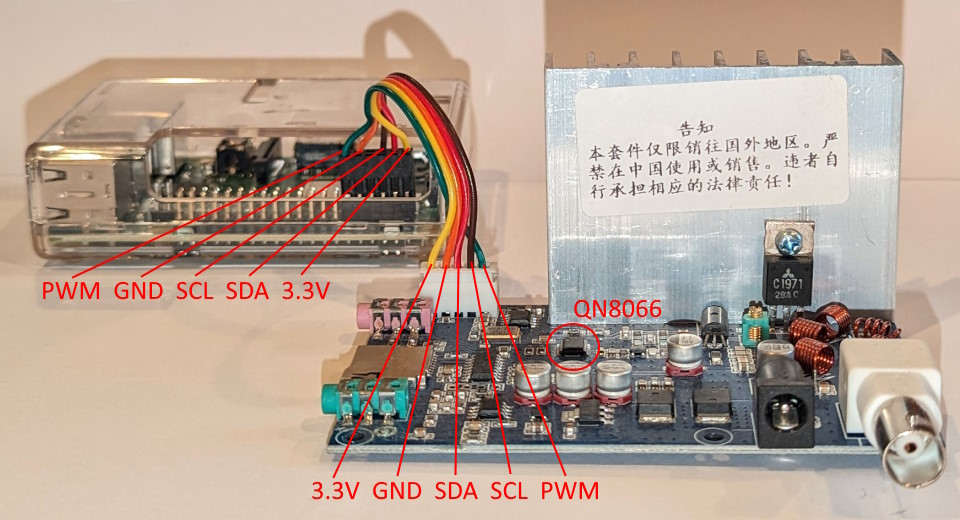
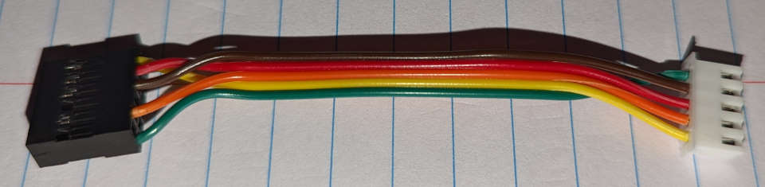

# Dynamic_RDS

A plugin for Falcon Player 6.0+ (FPP) to generate RDS (radio data system) messages similar to what is seen from typical FM stations. The RDS messages are fully customizable with static text, breaks, and grouping along with the supported data fields of title, artist, track number, track length, and main playlist item count. Currently, the plugin supportsthe QN8066 chip and there are plans to add the Si4173 in the future. The chips are controlled via the I<sup>2</sup>C bus.

## Recommended QN8066 transmitter board
> [!IMPORTANT]
> There are other similar looking boards, so double check for the QN8066 chip. For a detailed look at identifying QN8066 boards, check out [Spectraman's video](https://www.youtube.com/watch?v=i8re0nc_FdY&t=1017s).

[Aliexpress link to purchase QN8066 FM Transmitter](https://a.aliexpress.com/_mLTpVqO)


## Antenna
The QN8066 transmitter board needs an antenna for safe operations.

Small bench testing option - https://www.amazon.com/gp/product/B07K7DBVX9

Show ready option 1/4 wave - https://www.amazon.com/Transmitter-Professional-87-108mhz-0-5w-100w-Waterproof/dp/B09NDPY4JG

(More detail to be added)

## Cable and Connectors
> [!CAUTION]
> Do not run the PWM wire along side the I<sup>2</sup>C wires. During testing this caused failures in the I<sup>2</sup>C commands as soon as PWM was enabled.

### Connector info
* The connection on the transmitter board is a 5-pin JST-XH type connector, 2.54mm.
* The Raspberry Pis use a female Dupont connector and we recommended using a 2 x 6 block connector.
* The BeagleBone Blacks (BBB) use a male Dupont connector (recommendation pending BBB support work in progress).

If you are comfortable with crimping and making connectors, here are examples of what to use
* JST-XH connectors - https://www.amazon.com/dp/B015Y6JOUG
* Dupont connectors - https://www.amazon.com/dp/B0774NMT1S
* Single kit with both JST-XH and Dupont connectors - https://www.amazon.com/dp/B09Q5MPM7H/

Pre-crimped wires are also an options
* JST-XH Pre-crimped wires - https://www.amazon.com/dp/B0BW9TJN21
* Dupont Pre-crimped wires - https://www.amazon.com/dp/B07GD1W1VL

### Cable for a Raspberry Pi





The green PWM wire runs next to yellow 3.3V and orange GND wire until right before the end to eliminate issue with interference. (Still testing this, but...) Keep the cable as short as possible as well to reduce interference.

### Cable for a BeagleBone Black (BBB)
(Work in progress)

## Using Hardware PWM on Raspberry Pi
The recommended QN8066 transmitter board can take a PWM signal to increase its power output. Be sure to comply with all applicable laws related to FM broadcasts.

> [!CAUTION]
> Do not run the PWM wire along side the I<sup>2</sup>C wires. During testing this caused failures in the I<sup>2</sup>C commands as soon as PWM was enabled.

On the Raspberry Pi, in order to use the hardware PWM, the built-in analog audio must be disabled and an external USB sound card is required. The built-in audio uses both hardware PWM channels to generate the audio, so PWM cannot be used for other purposes when enabled.

Modify the /boot/config.txt by by doing the following, then rebooting:
1. Comment out ```dtparm=audio=on``` with a #
   - This line may appear multiple times in the file. Comment each instance.
2. Add the line ```dtoverlay=pwm```

Don't forget to change the Audio Output Device in the FPP Settings to use the USB sound card.

## FPP After Hours Music Plugin
The Dynamic RDS Plugin has the ability to work in conjunction with the FPP After Hours Music Plugin to provide RDS Data from an internet stream of music.

Just install the After Hours Music Plugin located here:

https://github.com/jcrossbdn/fpp-after-hours

Then activate its use in Dynamic RDS Plugin.


## Troubleshooting
### Transmitter not working (for the recommended QN8066 board)
- Verify transmitter is working on it's own
   - Connect the original screen, connect antenna, and 12v power
   - Connected to audio input near the screen connector
   - Check for transmission with a radio. If not, transmitter maybe bad and need to be replaced
   - Remove power, then disconnect screen

- Verify transmitter is working with RPi/BBB
  - With everything powered off, connect the transmitter to the RPi/BBB for 3v3, GND, SDA, and SCL
  - Do NOT connect the PWM pin
  - Verify each wire is connected correctly 3v3, GND, SDA, and SCL
  - Power up the RPi/BBB
  - Transmitter will power up from power supplied by RPi/BBB (Do NOT connect 12v power yet)
  - Verify the transmitter shows up on the I<sup>2</sup>C bus at 0x21
    - Either from the Dynamic RDS config page OR
    - SSH into the RPi ```i2cdetect -y 1``` and run or on BBB run ```i2cdetect -r -y 2```
  - If transmitter does not show up
    - Double check each wire is connectioned correctly 3v3, GND, SDA, and SCL
    - No really, go double check! It can happen to anyone! :)
    - Check each wire's continuity to make sure there isn't a break

### Transmitter's RDS not working well
- Enable Debug logging for the Engine
- Check for read and/or write errors in Dynamic_RDS_Engine.log
  - If too many errors happen, then I<sup>2</sup>C fails and the Engine exits
    - Check connection and wire continuity between RPi/BBB
    - Disconnect transmitter 12v power if connected and check I<sup>2</sup>C bus with `i2cdetect -y 1`
  - If errors happen at random
    - Make sure the PWM wire does NOT run along side the I<sup>2</sup>C wires, interference can occur
    - Try to lower the Chip Power and Amp Power, RF interference can impact I<sup>2</sup>C
    - Move the antenna further away from the transmitter board and Raspberry Pi / BBB
