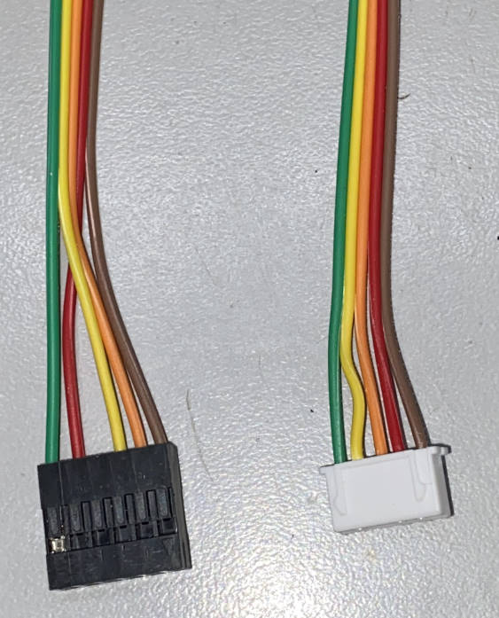

# Dynamic_RDS

An in-development plugin for Falcon Player (FPP) to generate RDS messages similar to what is seen by typical FM stations. Inital support for the QN8066 chip, with plans to add others in the future.

## Recommended QN8066 transmitter board

## Cable and Connectors

