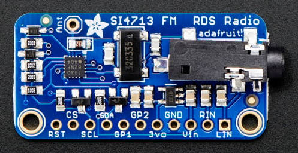
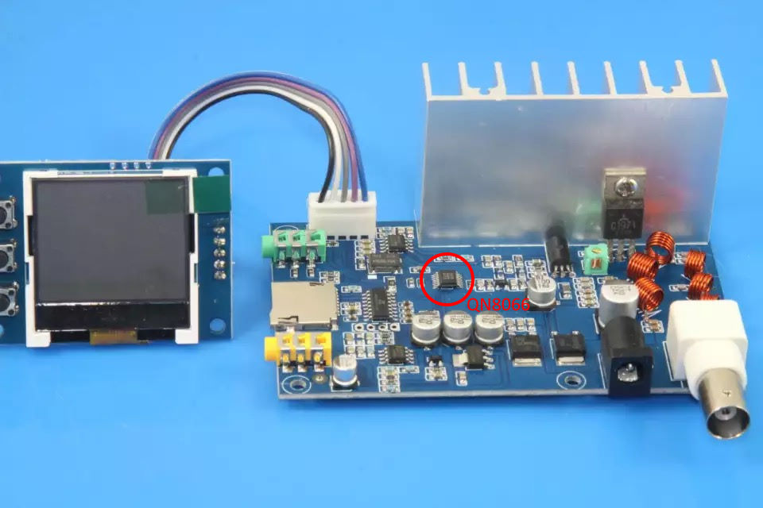
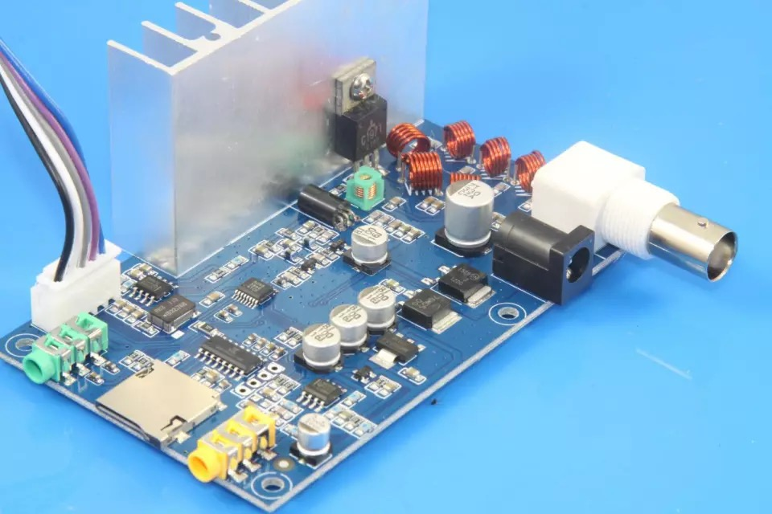
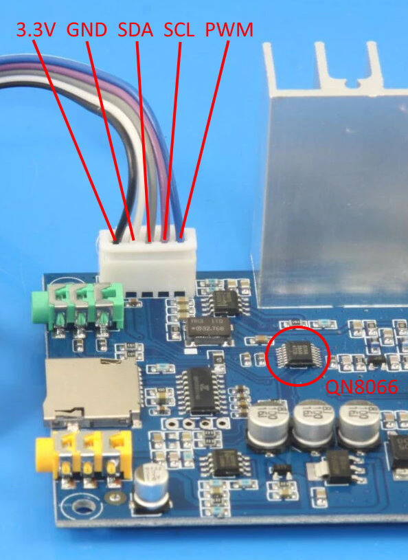
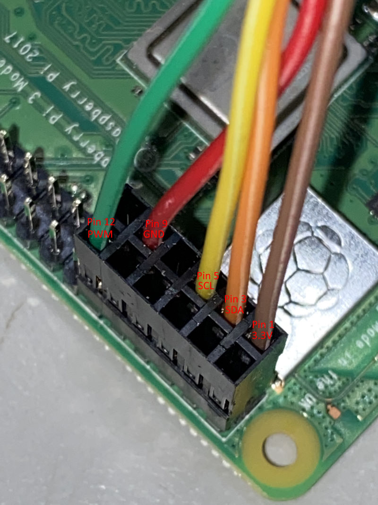
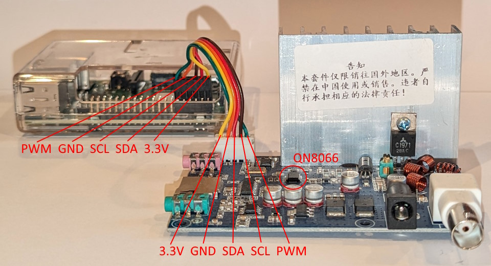
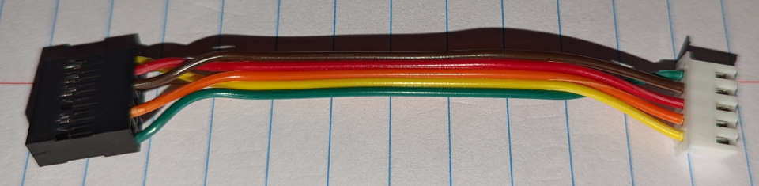
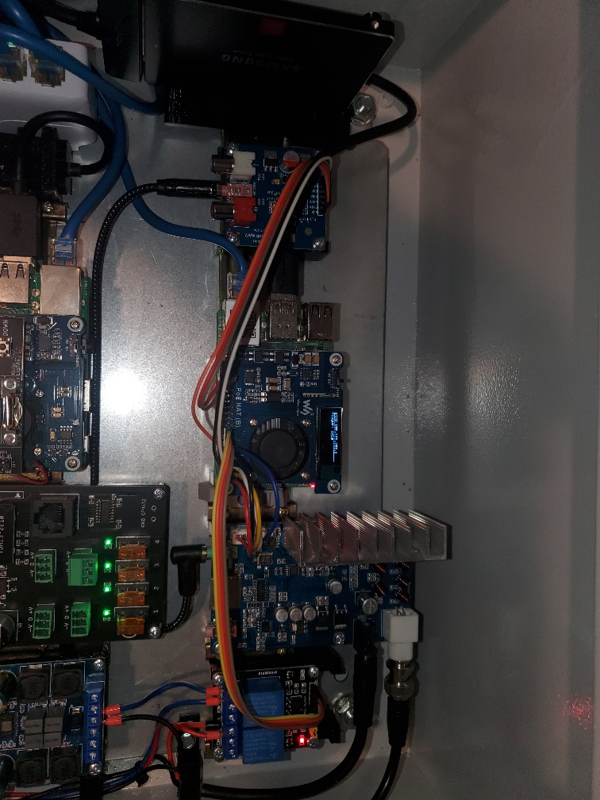
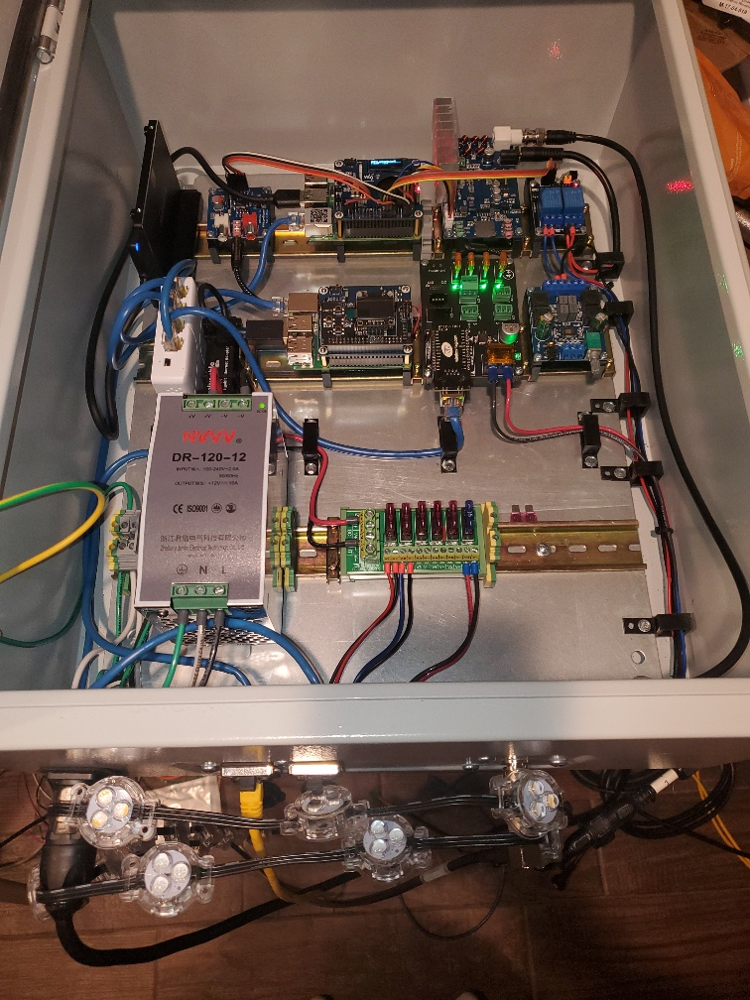

# Dynamic_RDS - FM Transmitter Plugin for Falcon Player

> [!NOTE]
> Dynamic_RDS supports the **QN8066** and **Si4713** FM transmitter chips

Originally created for Falcon Player 6.0 (FPP) and updated to support FPP 10.0+, the Dynamic_RDS plugin can generate RDS (radio data system) messages similar to what is seen from typical FM stations. The RDS messages are fully customizable with static text, breaks, and grouping along with the supported file tag data fields of title, artist, album, genre, track number, and track length, as well as main playlist position and item count. Currently, the plugin runs on Raspberry Pi or BBB and supports the QN8066 chip and the Si4713 chip. The chips are controlled via the I2C bus.

## Si4713 transmitter board
Originally, the Si4713 breakout board was available from [AdaFruit](https://www.adafruit.com/product/1958) but it now out of stock. There are many clones of this board that can be found on [AliExpress](https://www.aliexpress.us/w/wholesale-Si4713-transmitter.html) or by a [Google Search](https://www.google.com/search?q=Si4713+transmitter)

> [!NOTE]
> To reduce system load, the on-board buffers of the Si4713 are used by this plugin. The trade off is not being able to directly control the timing of each RDS message and a limitation of total message length based on how many buffers are available.

## QN8066 transmitter board
> [!IMPORTANT]
> There are other similar looking boards, so double check for the QN8066 chip. For a detailed look at identifying QN8066 boards, check out [Spectraman's video](https://www.youtube.com/watch?v=i8re0nc_FdY&t=1017s).

[Aliexpress link to search for QN8066 FM Transmitter](https://www.aliexpress.us/w/wholesale-5W-PLL-FM-Stereo-Transmitter-Max-power-7W.html)

### Antenna
The QN8066 transmitter board requires an antenna for safe operations. Below are some examples of antennas.

* Small bench testing option - https://www.amazon.com/gp/product/B07K7DBVX9
* 1/4 wave ground plane antenna calculator - https://m0ukd.com/calculators/quarter-wave-ground-plane-antenna-calculator/
* Show ready option 1/4 wave - https://www.amazon.com/Transmitter-Professional-87-108mhz-0-5w-100w-Waterproof/dp/B09NDPY4JG
* Inexpensive 1/4 wave option - https://www.aliexpress.us/item/2251832695723994.html
* BNC to BNC cable - https://www.amazon.com/gp/product/B0BVVVRYZL/)

### Cables, Connectors, and Shielding
> [!CAUTION]
> Do not run the PWM wire along side the I2C wires. During testing this caused failures in the I2C commands as soon as PWM was enabled.

#### Connector info
* The connection on the transmitter board is a 5-pin JST-XH type connector, 2.54mm.
* The Raspberry Pis use a female Dupont connector and we recommended using a 2 x 6 block connector.
* The BeagleBone Black (BBB) use a male Dupont connector.

If you are comfortable with crimping and making connectors, here are examples of what to use
* JST-XH connectors - https://www.amazon.com/dp/B015Y6JOUG
* Dupont connectors - https://www.amazon.com/dp/B0774NMT1S
* Single kit with both JST-XH and Dupont connectors - https://www.amazon.com/dp/B09Q5MPM7H/
* JST-XH kit with Crimping Tool - https://www.amazon.com/gp/product/B094XSF2GK

Pre-crimped wires are also an options
* JST-XH Pre-crimped wires - https://www.amazon.com/dp/B0BW9TJN21
* Dupont Pre-crimped wires - https://www.amazon.com/dp/B07GD1W1VL

#### Cable for a Raspberry Pi

The green PWM wire runs next to yellow 3.3V and orange GND wire until right before the end to eliminate issue with interference. Keeping the cable as short as possible helps to reduce interference.

#### Cable for a BeagleBone Black (BBB)
(Cable details for the BBB are still in progress)

#### Shielding and RF interference
Given the nature of an FM transmitter, interference is potential problem. This interference commonly shows up as I2C errors which become more frequent as transmitter power increases. Moving the antenna away from the RPi/BBB and the transmitter board can reduce this. A significantly more robust setup it to locate the RPi/BBB and transmitter board inside a grounded, metal case such as was done by @chrkov here:

### Using Hardware PWM on Raspberry Pi
The recommended QN8066 transmitter board can take a PWM signal to increase its power output. Be sure to comply with all applicable laws related to FM broadcasts.

> [!CAUTION]
> Do not run the PWM wire along side the I2C wires. During testing this caused failures in the I2C commands as soon as PWM was enabled.

On the Raspberry Pi, in order to use the hardware PWM, the built-in analog audio must be disabled and an external USB sound card or DAC is required. The built-in audio uses both hardware PWM channels to generate the audio, so PWM cannot be used for other purposes when enabled. Software PWM is also an option, but at an increased CPU cost and a decrease in duty cycle accuracy.

From the Dynamic_RDS configuration page, under the Power Settings, enable PWM.

This will automatically modify the `/boot/firmware/config.txt`:
1. Comment out all `dtparm=audio=on` lines with a `#`
2. Add the line `dtoverlay=pwm,pin=18,func=2` by default
Under the Advanced Options at the bottom of the configuration page, the output pin can be selected. This is also where Software PWM can be selected on most other pins.

> [!TIP]
> Don't forget to change the Audio Output Device in the FPP Settings to use the USB sound card or DAC

## Integration with FPP After Hours Music Plugin
The Dynamic_RDS plugin has the ability to work in conjunction with the [FPP After Hours Music Plugin](https://github.com/jcrossbdn/fpp-after-hours) to provide RDS Data from an internet stream of music. The information from the stream is populated in the Title field.

Once the After Hours Music Plugin is installed, the integration can be enabled on the Dynamic_RDS configuration pages in the MPC / After Hours Music section.

## Scripting Plugin Changes
During the plugin install, an example script is copied to the FPP `media/scripts` directory showing how to change the RDS style text. As an example, this could be used to change the PS and/or RT style text to be different during the show verses after. The script is located in [scripts/src_Dynamic_RDS_config.sh](scripts/src_Dynamic_RDS_config.sh) and the changes are made without having to restart FPP. The single quotes around the style text in the script are important so the Linux shell (bash) won't try to interpret what is in there. Use the script in the `media/scripts` folder and then use it with the scheduler (via Command -> Run Script) or playlists.

## Troubleshooting
### Transmitter not working (for the recommended QN8066 board)
- Verify transmitter is working on it's own
   - Connect the original screen, connect antenna, and 12v power
   - Connected to audio input near the screen connector
   - Check for transmission with a radio. If not, transmitter maybe bad and need to be replaced
   - Remove power, then disconnect screen

- Verify transmitter is working with RPi/BBB
  - With everything powered off, connect the transmitter to the RPi/BBB for 3v3, GND, SDA, and SCL
  - Do NOT connect the PWM pin
  - Verify each wire is connected correctly 3v3, GND, SDA, and SCL
  - Power up the RPi/BBB
  - Transmitter will power up from power supplied by RPi/BBB (Do NOT connect 12v power yet)
  - Verify the transmitter shows up on the I2C bus at 0x21
    - Either from the Dynamic_RDS config page OR
    - SSH into the RPi `i2cdetect -y 1` and run or on BBB run `i2cdetect -r -y 2`
  - If transmitter does not show up
    - Double check each wire is connectioned correctly 3v3, GND, SDA, and SCL
    - No really, go double check! It can happen to anyone! :)
    - Check each wire's continuity to make sure there isn't a break

### Transmitter's RDS not working well
- Enable Debug logging for the Engine
- Check for read and/or write errors in plugin-Dynamic_RDS.log
  - If too many errors happen, then I2C fails and the Engine exits
    - Reduce the Amp Power
    - Try using Software I2C
    - Enclose the RPi/BBB and transmitter in a grounded, metal box with the antenna outside of the box
    - Check connection and wire continuity between RPi/BBB
    - Disconnect transmitter 12v power if connected and check I2C bus with `i2cdetect -y 1`
  - If errors happen at random
    - Make sure the PWM wire does NOT run along side the I2C wires, interference can occur
    - Try to lower the Chip Power and Amp Power, RF interference can impact I2C
    - Move the antenna further away from the transmitter board and RPi/BBB

## Plugin Settings
All settings are on the plugin's config page, reachable from **Status/Control -> Dynamic RDS**. The page auto-detects your transmitter over I2C and hides the settings that don't apply to it.

> [!NOTE]
> Settings marked with a lightning bolt icon take effect immediately on the transmitter — no FPP restart needed.

### RDS Settings
| Setting | Default | Notes |
| --- | --- | --- |
| Enable RDS | On | Turns off all RDS transmission when unchecked |
| PI Code | `819b` | Program Identification code. Some older receivers translate this to a callsign — `819b` is WRAP, `5F64` is WEBS |
| Program Type | 2 - Information / Current Affairs | Standard PTY list; assignments differ between North America and Europe |
| PS Style Text | `{T}\|{A}[\|{P} of {C}]\|Merry\|Christ-\|   -mas!` | Program Service, sent 8 characters at a time. This is what most radios display |
| PS Update Rate | 4 sec | Interval between 8-character updates (3-60). It takes ~1 second to send 8 characters, and some radios only display text after receiving a group twice |
| RT Style Text | `{T}[ by {A}][\|Track {P} of {C}] Merry Christmas!` | Radio Text — longer messages, slower update rate |
| RT Update Size | 32 chars | RT supports up to 64, but not all radios display that much at once. 32 is recommended |
| RT Update Rate | 7 sec | Interval between RT updates (3-60). Sending a full 64 characters takes ~4 seconds |

### Style Text Substitutions
The PS and RT style text fields accept substitutions that are filled in from the currently playing media:

| Code | Value |
| --- | --- |
| `{T}` | Title |
| `{A}` | Artist |
| `{B}` | Album |
| `{G}` | Genre |
| `{N}` | Track Number |
| `{L}` | Track Length, as 0:00 |
| `{C}` | Item count in the Main Playlist section |
| `{P}` | Item position in the Main Playlist section |

Formatting rules:
* Any static text can be mixed in freely
* `|` (pipe) splits between RDS groups, acting like a line break
* `[ ]` creates a subgroup — if **any** substitution inside is empty, the whole subgroup is dropped. This is how you avoid stray text like "by" with no artist
* Use `\` in front of `| { } [ ]` to display those characters literally
* The end of the style text implicitly acts as a line break
* `{P}` is set empty when both it and `{C}` are 1, to prevent "Track 1 of 1" messages

### Transmitter Type and Settings
| Setting | Default | Notes |
| --- | --- | --- |
| Transmitter Type | Auto-selected | Set from I2C detection (QN8066 at 0x21, Si4713 at 0x63). Can be overridden manually |
| Frequency | 100.10 | 60.00-108.00 for QN8066, 76.00-108.00 for Si4713 |
| Preemphasis | 75 &mu;s | 75 &mu;s for the US and South Korea, 50 &mu;s for most of the rest of the world |
| Antenna Tuning Capacitor *(Si4713)* | 0 | 0 lets the chip auto-tune; manual range is 1-191 |
| Reset Pin / GPIO *(Si4713)* | Pin 7 / GPIO 4 | The Si4713 needs its reset pin high for normal operation |

### Audio Settings (QN8066)
| Setting | Default | Notes |
| --- | --- | --- |
| Gain Adjustment | 0 | Range -15 to +20. Too high or too low causes distortion, random dropouts, or silence |
| Enable Soft Clipping | On | |
| Enable AGC | Off | Not recommended |

### Power Settings
| Setting | Default | Notes |
| --- | --- | --- |
| Chip Power *(QN8066)* | 122 | Range 92-122 |
| Chip Power *(Si4713)* | 115 | Range 88-120. Voltage accuracy above 115 dB&mu;V is not guaranteed |
| Enable PWM *(QN8066)* | Off | Hardware PWM on Pin 12 / GPIO 18 by default, used to control amplifier power. Requires on-board audio to be disabled, so an external sound card is needed |
| Amp Power *(QN8066)* | 0 | Range 0-100, controlled via PWM output |

### Plugin Activation
| Setting | Default | Notes |
| --- | --- | --- |
| Start with | FPPD Start | Or Playlist Start, or Never. On start the transmitter is reset, settings initialized, audio broadcast begins, and static RDS messages are sent |
| Stop with | Never | Or Playlist Stop. On stop the transmitter is reset and listeners hear static |

### MPC / After Hours Music
Enable to pull `%title%` from mpc and display it as `{T}` when FPP is otherwise idle. Only appears if the After Hours Music Player plugin is installed.

### MQTT
Publishes plugin status to MQTT. Requires MQTT to be configured first under **FPP Settings -> MQTT**, and `python3-paho-mqtt`, which can be installed with a button on the config page.

### Log Levels and Logs
Callback and Engine logging levels are set separately (Errors Only / Warn / Info / Debug, plus Excessive for the Engine). Both write to `plugin-Dynamic_RDS.log`, viewable from the config page.

### Report an Issue
Set the log levels to Debug, reproduce the problem, then use **Download log and config zip** and attach the file to a [new issue](https://github.com/ShadowLight8/Dynamic_RDS/issues). The zip contains the log and rotated copies, the `plugin.Dynamic_RDS` config, last RDS output, the plugin version, and your Pi/BBB boot config.

### Advanced Options
Software I2C mode for the Raspberry Pi, and PWM pin selection for both the Pi and BeagleBone Black. Most setups won't need to touch these.
