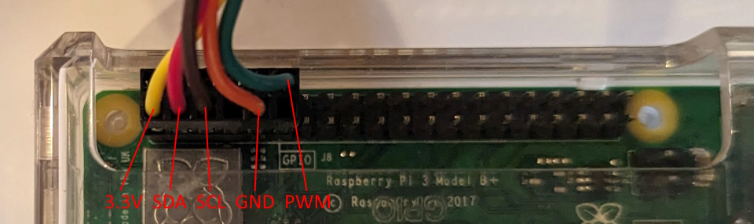

# Dynamic_RDS

A plugin for Falcon Player 6.0+ (FPP) to generate RDS (radio data system) messages similar to what is seen from typical FM stations. The RDS messages are fully customizable with static text, breaks, and grouping along with the supported data fields of title, artist, track number, track length, and main playlist item count. Currently, the plugin supports the QN8066 chip and there are plans to add the Si4173 in the future.

## Recommended QN8066 transmitter board
```CAUTION: There are other similar looking boards, so double check for the QN8066 chip.``` For a detailed look at identifying QN8066 boards, check out [Spectraman's video](https://www.youtube.com/watch?v=i8re0nc_FdY&t=1017s).

[Aliexpress link to purchase QN8066 FM Transmitter](https://a.aliexpress.com/_mLTpVqO)

[EBay link to purchase QN8066 FM Transmitter](https://www.ebay.com/itm/275031067583?mkcid=16&mkevt=1&mkrid=711-127632-2357-0&ssspo=PB6d-PpwRGC&sssrc=2349624&ssuid=rZ11O1LCRam&var=&widget_ver=artemis&media=COPY)


## Cable and Connectors
```CAUTION: Do not run the PWM wire along side the I2C wires.``` During testing this caused failures in the I2C commands as soon as PWM was enabled.

Pin configuration for a Raspberry Pi



Pin configuration for the Transmitter - Connector is a 5-pin JST-XH type


## Using Hardware PWM
The recommended QN8066 transmitter board can take a PWM signal to increase its power output. Be sure to comply with all applicable laws related to FM broadcasts.

```CAUTION: Do not run the PWM wire along side the I2C wires.``` During testing this caused failures in the I2C commands as soon as PWM was enabled.

On the Raspberry Pi, in order to use the hardware PWM, the built-in analog audio must be disabled and an external USB sound card is required. The built-in audio uses both hardware PWM channels to generate the audio, so PWM cannot be used for other purposes when enabled.

Modify the /boot/config.txt by by doing the following, then rebooting:
1. Comment out ```dtparm=audio=on``` with a #
   - This line may appear multiple times in the file. Comment each instance.
2. Add the line ```dtoverlay=pwm```

Don't forget to change the Audio Output Device in the FPP Settings to use the USB sound card.

## FPP After Hours Music Plugin
The Dynamic RDS Plugin has the ability to work in conjunction with the FPP Aftyer Hours Music Plugin to provide RDS Data from an internet stream of music.

Just install the After Hours Music Plugin located here:

https://github.com/jcrossbdn/fpp-after-hours

Then activate its use in Dynamic RDS Plugin.


