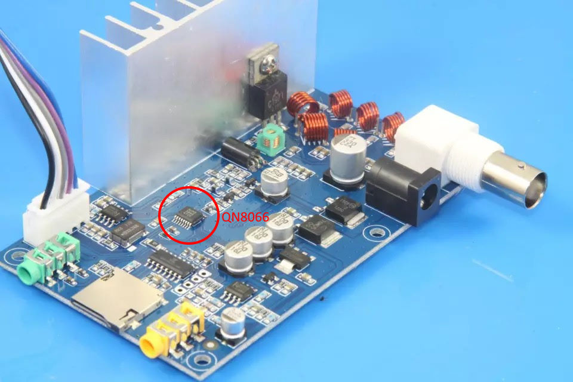

# Dynamic_RDS

An in-development plugin for Falcon Player (FPP) to generate RDS messages similar to what is seen by typical FM stations. Initial support for the QN8066 chip, with plans to add others in the future.

## Recommended QN8066 transmitter board
**There are other similar looking boards, so double check for the QN8066 chip.** Spectraman details how to [identify the correct board in his video](https://www.youtube.com/watch?v=i8re0nc_FdY&t=1017s).

[Aliexpress link to purchase QN8066 FM Transmitter](https://a.aliexpress.com/_mLTpVqO)

[EBay link to purchase QN8066 FM Transmitter](https://www.ebay.com/itm/275031067583?mkcid=16&mkevt=1&mkrid=711-127632-2357-0&ssspo=PB6d-PpwRGC&sssrc=2349624&ssuid=rZ11O1LCRam&var=&widget_ver=artemis&media=COPY)

## Cable and Connectors
CRITICAL NOTE - Do not run the PWM wire along side the I2C wires
During testing this caused failures in the I2C commands as soon as PWM was enabled.

Pin configuration for a Raspberry Pi

